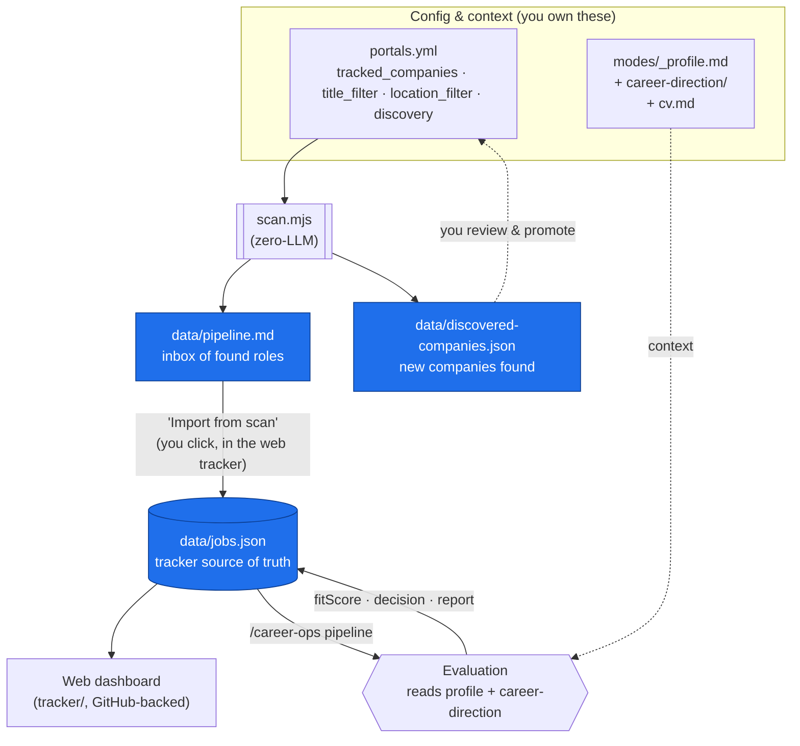
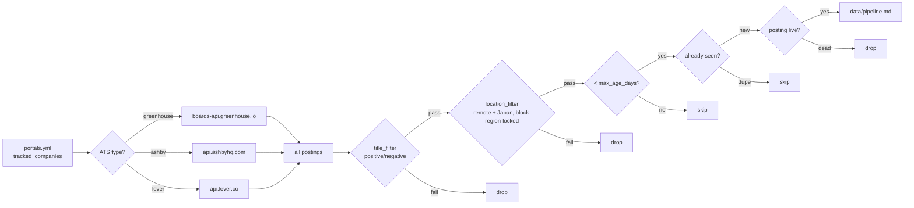
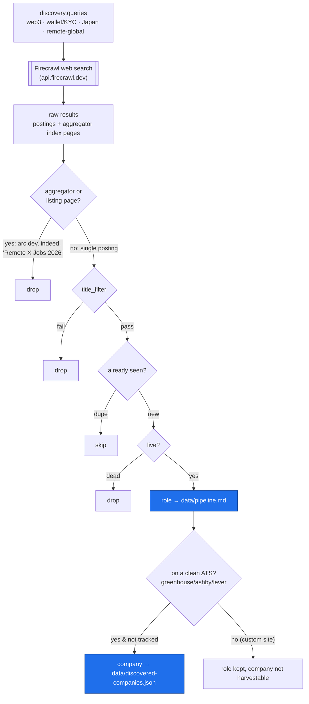
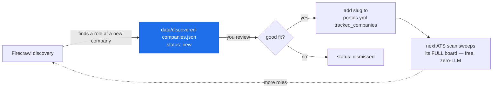

# Scan & Data-Expansion Workflow

How career-ops finds roles, how scanning works **with and without Firecrawl**, and how the tracked company list **grows itself** over time.

## 1. The whole system at a glance



**Key idea:** `scan.mjs` never writes to `jobs.json` directly. It fills an **inbox** (`pipeline.md`), and you pull roles into the tracker with **Import from scan**. Evaluation is a separate step that scores them.

## 2. Scan WITHOUT Firecrawl (default — known companies only)

Zero cost, zero LLM. Sweeps only the companies already in `portals.yml`.



**Limitation:** it can only ever find roles at companies you already listed. To find *new* companies, you need discovery.

## 3. Scan WITH Firecrawl (discovery — the whole internet)

Turn on with `discovery.enabled: true` in `portals.yml` + a `FIRECRAWL_API_KEY`. Runs **in addition to** the ATS scan above, then feeds the same filters.



Discovery does two things at once: adds **roles** to the pipeline inbox, and harvests **new companies** to `discovered-companies.json`.

## 4. The data-expansion loop (why discovery compounds)

Each discovery run can grow your tracked set, so the *next* zero-cost ATS scan is wider.



**The payoff:** Firecrawl finds *one* role at, say, Nametag → the company lands in `discovered-companies.json` → you add it to `portals.yml` → every future scan pulls **all** of Nametag's postings for free. Discovery is the scout; the tracked ATS list is the cheap recurring sweep.

## Sources of truth

| File | What it holds | Written by |
|------|---------------|-----------|
| `portals.yml` | scanner config (companies, filters, discovery) | you (gitignored, local) |
| `data/pipeline.md` | inbox of freshly-scanned roles | `scan.mjs` |
| `data/discovered-companies.json` | new companies found via Firecrawl | `scan.mjs` |
| `data/jobs.json` | the curated tracker | web tracker + evaluation |
| `data/companies.json` | dashboard company list | web tracker |

## Commands

```bash
npm run scan          # ATS scan (+ Firecrawl discovery if enabled in portals.yml)
# then: open the web tracker → "Import from scan" → roles become pending jobs
# then: /career-ops pipeline → evaluate & score the pending jobs
```
